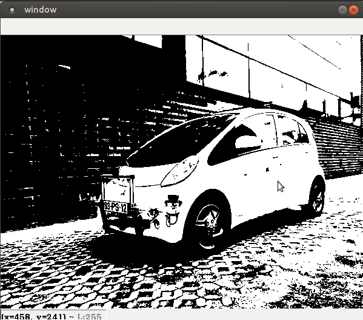
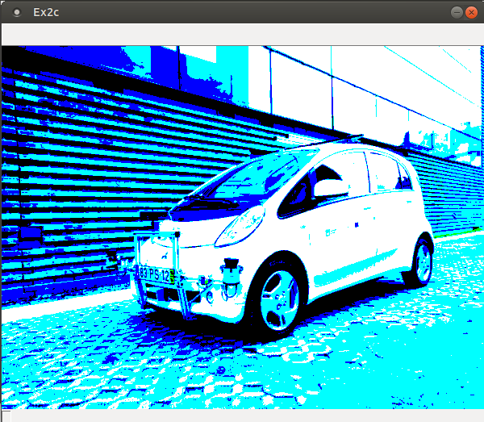
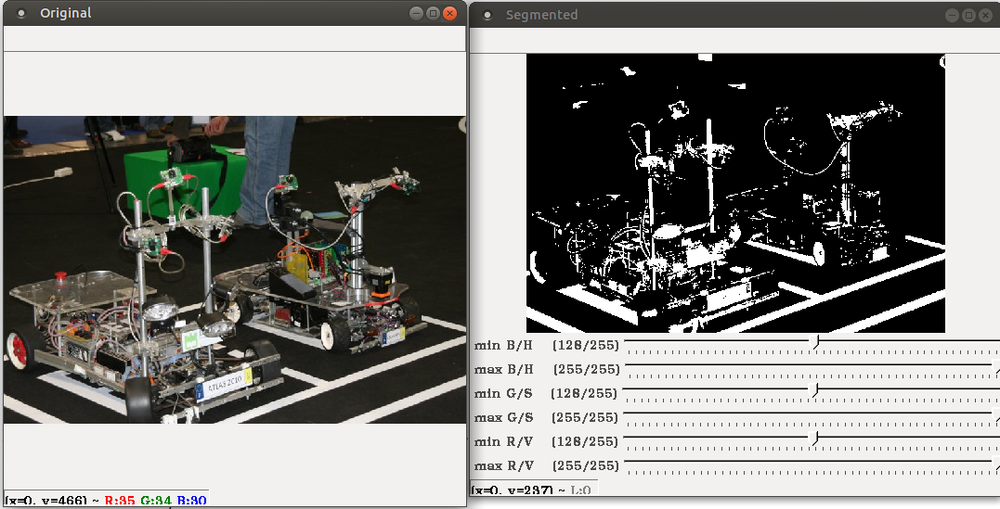

# Parte 5 - PSR

### Sumário

    Introdução ao OpenCV.

O *opencv* é uma biblioteca muito poderosa para fazer processamento de
imagem e visão artificial, entre outras funcionalidades. A partir da
versão 3 orientou-se especialmente para programação em C++ e Python.

# Instalação
Para instalar o opencv com os bindings em python usar o comando:

    sudo apt-get install python3-opencv

Mais informação em
<https://docs.opencv.org/master/d2/de6/tutorial_py_setup_in_ubuntu.html>

Para saber a versão instalada do opencv pode, num terminal python fazer:

    import cv2
    cv2.__version__

# Exercício 1 - Leitura de imagens

As imagens para teste estão presentes na pasta docs da pasta desta aula.

## 1 a)

Implemente o seguinte código para leitura e display de uma image usando
o opencv. Mais informação neste
[tutorial](https://docs.opencv.org/3.1.0/dc/d2e/tutorial_py_image_display.html).

``` Python
import cv2

def main():

    image_filename = 'path to my image .png'
    image = cv2.imread(image_filename, cv2.IMREAD_COLOR) # Load an image

    cv2.imshow('window', image)  # Display the image
    cv2.waitKey(0) # wait for a key press before proceeding


if __name__ == '__main__':
    main()
```

## 1 b)

Adicione a funcionalidade de inserir o nome (full path) da imagem a ler.
Experimente ler as imagens dos dois atlascars que estão na pasta
*imagens* ([atlascar.png](imagens/atlascar.png) e [atlascar2.png](imagens/atlascar2.png)).

> [!NOTE]
Use o package argparser

## 1 c)

Altere o script de modo a que o programa mostre alternadamente os dois
atlascars na mesma janela. A mudança de carro mostrado deve dar-se a
cada 3 segundos.

> [!NOTE]
> O primeiro argumento da função `cvWaitKey` é o número máximo de
> milisegundos a esperar por uma tecla.
>
> Em alternativa pode usar a função [sleep do package time](https://www.datacamp.com/community/tutorials/python-time-sleep?utm_source=adwords_ppc&utm_campaignid=898687156&utm_adgroupid=48947256715&utm_device=c&utm_keyword=&utm_matchtype=b&utm_network=g&utm_adpostion=&utm_creative=332602034352&utm_targetid=dsa-429603003980&utm_loc_interest_ms=&utm_loc_physical_ms=1011706&gclid=Cj0KCQjwwOz6BRCgARIsAKEG4FVkKPOEdKcj7_vQ9aU-6TrPIhvgDYeR_3WXZsgRAOPOHLIDb_abi3IaAgAEEALw_wcB).

# Exercício 2 - Processamento de imagem
## 2 a)

Carregue uma imagem do atlascar e binarize-a usando a função:

```python
# Primeiro converter para escala de cinza
image_gray = cv2.cvtColor(image, cv2.COLOR_BGR2GRAY)
retval, image = cv2.threshold(image_gray, 128, 255, cv2.THRESH_BINARY)
```

> [!NOTE]
Todas as funções do opencv estão documentadas em
<https://docs.opencv.org/master/index.html>



## 2 b)

Nos bindings para opencv de python, as imagens são representadas por
numpy nd arrays, que são arrays n-dimensionais. Para imagens de 640x480
de cor, por exemplo, os arrays terão o tamanho 480 (linhas) x 640
(colunas) x 3 (canais de cor).

Pode imprimir o tipo do uma qualquer variável em python usando a função
type:

    print(type(image))

Para ver o tamanho de um numpy array use:

    print(image.shape)

Para ver o tipo de dados (data type) dos elementos do numpy ndarray use:

[NumPy](https://numpy.org/) é uma biblioteca python muito eficiente para
cálculo matricial (a razão pela qual foi usada pelos bindings para
python em opencv). O numpy é semelhante ao matlab na síntaxe e forma de
operar matricial.

Assim, pode fazer alterações às imagens operando-as como se fossem
matrizes em numpy. Sendo *image* uma variável do tipo numpy ndarray,
pode simplesmete usar uma comparação:

    image_thresholded = image > 128

Substitua a alínea **2 a)** de modo a fazer a binarização usando o
operador numpy ndarray. Deverá ter o mesmo resultado.

Veja qual o tipo de dados de saída da *image_threshold* quando usa a
função do opencv e quando usa o operador numpy.

## 2 c)
Utilize a função `cv2.split()` para separar a imagem *atlascar2.png* nos
seus três canais de cor (b,g,r). Cada canal deverá ser binarizado usando
diferentes limites de binarização (b=50,g=100,r=150). Posteriormente, as
imagens binarizadas de cada canal deverão ser concatenadas (cv2.merge)
para formar uma nova imagem RGB, a mostrar numa janela.



## 2 d)
Leia a imagem *atlas2000_e\_atlasmv.png*.

Usando a função *cv2.inRange* crie uma máscara dos pixeis com valores de
rgb entre (bmin, gmin, rmin) e (bmax, gmax, rmax). Parametrize de modod
a segmentar o caixote verde por trás dos robôs.


Se mostrar a imagem original com o imshow pode depois colocar o rato
sobre a zona do caixote para inspeccionar o valor típico dos pixeis
naquele objeto.

## 2 e)
Faça a segmentação do mesmo objeto (cor verde) desta vez usando o modelo
de cor HSV. O resultado deve ser o mesmo que na alínea anterior.

Para converter de BGR para HSV

``` Python
image_hsv = cv.cvtColor(image_rgb, cv2.COLOR_BGR2HSV)
```

## 2 f)
Usando uma adição da imagem original por um escalar para cada canal,
pinte de vermelho o caixote verde detetado na alínea anterior.


## Exercício 3 - Graphical user interface

As graphical user interfaces são, como o nome indica, ferramentas de
interação com o utilizador. São muito úteis como alternativa à inserção
de texto no terminal.

## 3 a)
Partindo do exercício **2 a)** implemente uma trackbar que permita ao
utilizador definir o limite de binarização a ser utilizado na
binarização.

Ver instruções sobre [trackbars em
opencv](https://docs.opencv.org/3.4/da/d6a/tutorial_trackbar.html).

``` Python
import argparse
import cv2

# Global variables
window_name = 'window - Ex3a'
image_gray = None


def onTrackbar(threshold):
    # Add code here to threshold image_gray and show image in window

def main():
    parser = argparse.ArgumentParser()
    parser.add_argument('-i', '--image', type=str, required=True,help='Full path to image file.')
    args = vars(parser.parse_args())

    image = cv2.imread(args['image'], cv2.IMREAD_COLOR)  # Load an image
    global image_gray # use global var
    image_gray = cv2.cvtColor(image, cv2.COLOR_BGR2GRAY)  # convert bgr to gray image (single channel)
    cv2.namedWindow(window_name)

    # add code to create the trackbar ...
    cv2.waitKey(0)

if __name__ == '__main__':
    main()
```

## 3 b)
Apesar de funcional, o Exercício **3 a)** tem o problema de necessitar de
variáveis globais, que o são por terem de ser acedidas quer pela função
*main* quer pela função *onTrackbar*. Ler mais aqui sobre o [scope de
variáveis](https://www.datacamp.com/community/tutorials/scope-of-variables-python?utm_source=adwords_ppc&utm_campaignid=898687156&utm_adgroupid=48947256715&utm_device=c&utm_keyword=&utm_matchtype=b&utm_network=g&utm_adpostion=&utm_creative=229765585186&utm_targetid=dsa-429603003980&utm_loc_interest_ms=&utm_loc_physical_ms=1011706&gclid=Cj0KCQjwwOz6BRCgARIsAKEG4FXVGtlBHc6VmZN0XsQ4s1jVjldG5sOlV50Od66LKdXOulnWYa190AAaAgxlEALw_wcB)

As variáveis globais não são recomendadas por terem [vários
problemas](https://www.reddit.com/r/Python/comments/25jzga/what_exactly_makes_global_variables_so_bad/).

Altere o **Ex 3 a)** de modo a não utilizar variáveis globais.

Será necessário que a função receba como argumentos todas as variáveis
de que necesita. Ver as funcionalidades da função
[partial](https://docs.python.org/2/library/functools.html#partial-objects).

## 3 c)
Partindo do **Ex3 b)** e usando a funçao
[setMouseCallback](https://docs.opencv.org/2.4/modules/highgui/doc/user_interface.html?highlight=setmousecallback#setmousecallback)
acrescente a funcionalidade de imprimir as coordenadas do rato sempre
que se pressiona o botão esquerdo do rato.

## 3 d)
Implemente um programa que permita configurar a segmentação de cor. O
programa deve executar a segmentação verificando quais os pixeis da
imagem que estão dentro de certos limites mínimo e máximo. Estes limites
deverão ser diferentes para cada canal de cor. O programa deve mostrar 6
trackbars no total, para configurar aqueles limites:

a.  limite mínimo e máximo para o canal B (ou H)

b.  limite mínimo e máximo para o canal G (ou S)

c.  limite mínimo e máximo para o canal R (ou V)

De cada vez que o utilizador alterar uma trackbar o valor do limite
correspondente altera-se, e portanto é preciso realizar nova segmentação
e mostrar o resultado.

A aplicação deve poder receber um argumento pela linha da comando que
indique que deve operar com uma imagem HSV em vez da habitual BGR.

A aplicação deve utilizar um dicionário python com informação sobre os
limites das variáveis como descrito em baixo.

``` Bash
{'limits': {'B': {'max': 200, 'min': 100},
            'G': {'max': 200, 'min': 100},
            'R': {'max': 200, 'min': 100}}}
```

Quando termina a aplicaçao devera gravar um ficheiro *limits.json* com o
dicionario descrito em cima.

Exemplo para gravar um dicionário para um ficheiro json.

``` Python
file_name = 'limits.json'
with open(file_name, 'w') as file_handle:
    print('writing dictionary d to file ' + file_name)
    json.dump(d, file_handle) # d is the dicionary
```



Aqui um exemplo da [aplicação em
funcionamento](https://youtu.be/5ehqBuBWQZM)
