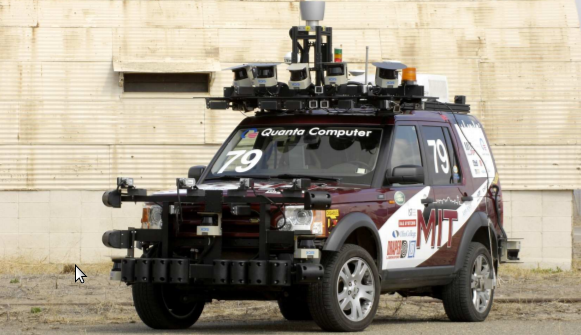
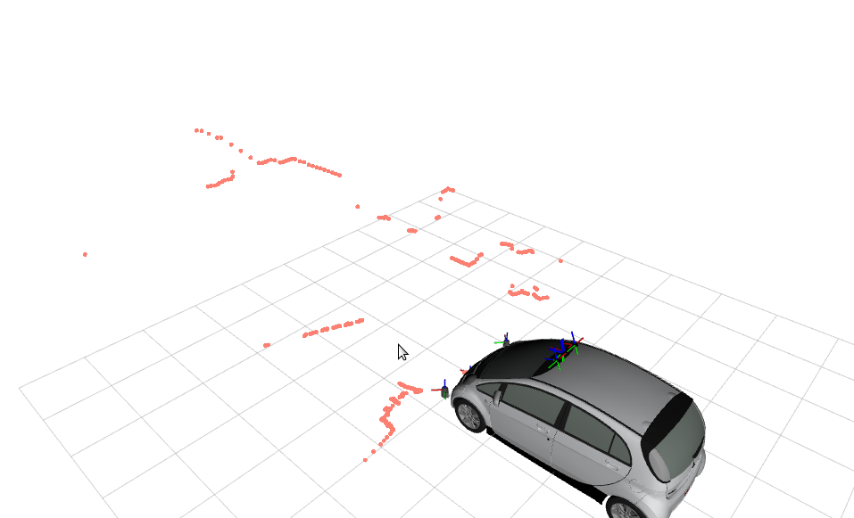
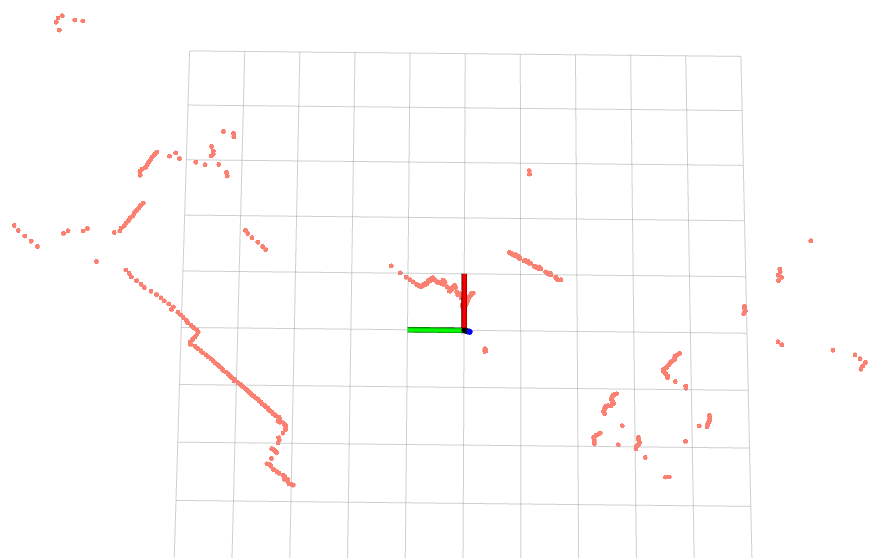
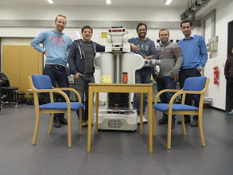
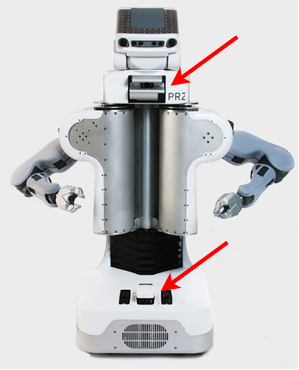
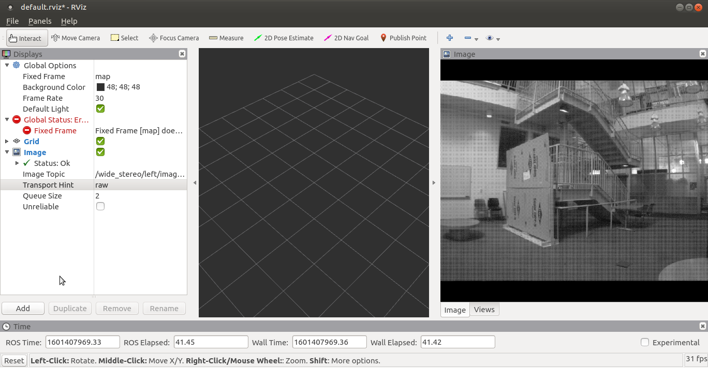

# Parte 10 - PSR

### Sumário

    Sensores mais utilizados em robótica
    Mensagens standard em ROS (sensor_msgs)
    Visualização de mensagens com o RVIZ

Um sensor é um aparelho que permite adquirir informação sobre o meio
onde está inserido. Os sistemas robóticos mais complexos têm por vezes
dezenas de sensores a bordo. Por exemplo, o robô
[Atlascar2](http://atlas.web.ua.pt/), que foi o [primeiro veículo
autónomo em Portugal numa demonstração em
2011](https://www.youtube.com/watch?v=f4U0UPkai58), continha uma grande
variedade de sensores a bordo.


Outro exemplo interessante é o veículo *Talos* que foi o concorrente ao
DARPA challenge do *MIT*.



Existem vários sensores frequentemente utilizados em robótica, mas são
sobretudo de 3 tipos, tendo em conta a natureza da informação que
adquirem :

1.  Sensores que adquirem informação de distâncias, e.g. Lidars, 3D
    Lidars, RGBD cameras, etc;

2.  Sensores que adquirem outra informação que não a distância.
    Habitualmente medem radiação no espectro visível (câmaras RGB
    clássicas), ou no infravermelho (câmaras térmicas);

3.  Sensores que adquirem informação sobre o próprio sistema robótico,
    e.g. acelerómetros, bússulas, IMUs, GPSs, etc.

Nesta aula serão descritos vários sensores bem como as mensagens
utilizadas em ROS para representar os dados de cada um deles.

# Exercício 1 - LiDARs 2D

LiDAR é o acrónimo de **L**ight **D**etection **A**nd **R**anging. Esta
tecnologia consiste na emissão de um [feixe
laser](https://pt.wikipedia.org/wiki/Laser) (luz monocromática, coerente
e colimada) numa direção e na aferição da distância do local de emissão
(o sensor) até ao objeto em que o feixe reflete através da medição do
tempo de vôo do feixe emitido.

De modo a medir distâncias em várias direções o feixe é projetado na
direção de um espelho rotativo. Assim, para cada posição do espelho é
medida uma distância, e o resultado é um plano com várias medidas, a
cada uma correspondendo um ângulo *theta* (posição do espelho) e uma
distância *r* (a distância medida). Estas medições têm um mapeamento
direto para um [sistema de coordeadas
polares](https://en.wikipedia.org/wiki/Polar_coordinate_system).





Descarregue este [bag
file](https://drive.google.com/file/d/1RiiccHi6llD1sy86LHVL0QpZzrQQCFuT/view?usp=sharing)
com mensagens de um LiDAR 2D. Pode inspecionar o bag com o comando
*rosbag info \<bag_name\>*.

``` bash
➜  psr rosbag info lidar_example.bag
path:        lidar_example.bag
version:     2.0
duration:    23.2s
start:       Sep 29 2020 08:01:58.75 (1601362918.75)
end:         Sep 29 2020 08:02:21.99 (1601362941.99)
size:        4.9 MB
messages:    1163
compression: none [7/7 chunks]
types:       sensor_msgs/LaserScan [90c7ef2dc6895d81024acba2ac42f369]
topics:      /left_laser/laserscan   1163 msgs    : sensor_msgs/LaserScan
```

Como é possível ver pela informação do bagfile, as mensagens são do tipo
[sensors_msgs/laserscan](http://docs.ros.org/api/sensor_msgs/html/msg/LaserScan.html),
que contêm os seguintes campos:

``` msg
# Single scan from a planar laser range-finder
#
# If you have another ranging device with different behavior (e.g. a sonar
# array), please find or create a different message, since applications
# will make fairly laser-specific assumptions about this data

Header header            # timestamp in the header is the acquisition time of
                         # the first ray in the scan.
                         #
                         # in frame frame_id, angles are measured around
                         # the positive Z axis (counterclockwise, if Z is up)
                         # with zero angle being forward along the x axis

float32 angle_min        # start angle of the scan [rad]
float32 angle_max        # end angle of the scan [rad]
float32 angle_increment  # angular distance between measurements [rad]

float32 time_increment   # time between measurements [seconds] - if your scanner
                         # is moving, this will be used in interpolating position
                         # of 3d points
float32 scan_time        # time between scans [seconds]

float32 range_min        # minimum range value [m]
float32 range_max        # maximum range value [m]

float32[] ranges         # range data [m] (Note: values < range_min or > range_max should be discarded)
float32[] intensities    # intensity data [device-specific units].  If your
                         # device does not provide intensities, please leave
                         # the array empty.
```

Pode consultar o manual com todas as
[sensor_msgs](http://wiki.ros.org/sensor_msgs) de modo a analisar o tipo
de dados de que necessita a cada momento.

Faça o playback do bagfile em modo contínuo (flag -l) com o comando:

    rosbag play <bag file name> -l

Escreva um script python denominado *lidar_subscriber.py*, que receba
mensagens do tipo *sensor_msgs/laserscan*, converta a informação contida
nestas mensagens de coordenadas polares para coordenadas cartesianas, de
modo a construir uma mensagem do tipo
[sensor_msgs/PointCloud2](http://docs.ros.org/api/sensor_msgs/html/msg/PointCloud2.html).
Esta núvem de pontos correspondente a cada laser scan deve ser
publicada.

Crie um novo package ros *psr_aula10* onde irá colocar todos os scripts
desenvolvidos.

Pode ver aqui um [vídeo com uma
demonstração](https://youtu.be/uZ1pPMIeyw4) do que se pretende.

# Exercício 2 - LiDARs 3D

O robô icónico do ROS e um grande motor do seu desenvolvimento foi o
[PR2](http://wiki.ros.org/Robots/PR2). Por exemplo o [projeto europeu
RACE](https://www.project-race.eu/dissemination/videos/) (2012-2015)
utilizou um PR2 como plataforma de testes e validação dos algoritmos
desenvolvidos, mas existem muitos outros casos.



O PR2 contém vários sensores, mas os que interessam para este caso são
os dois LiDARS 2D. Um deles, está localizado na base do robô e é fixo,
enquanto o segundo está montado na zona do pescoço e tem um movimento
adicional de *tilt*. Este movimento de *tilt* confere um graus de
liberdade adicional ao sistema, transformando as coordenadas polares em
esféricas. Assim, esta alteração permite alterar o plano de medição do
equipamento, transformando-o num Lidar3D, já que agora efetua medições
não apenas num plano mas em todo um hemisfério.



Pretende-se neste exercício visualizar os dados do Lidar2D e do Lidar3D
a bordo do PR2. bagfile pequeno chamado pr2_mit_demo_pari.bag. Aqui o
[link direto para
download](https://drive.google.com/file/d/1OsbOiF3TcFNe4eB8sDZqIjk4Wm_7Oevx/view?usp=sharing)
desse bag file.

Descarregue o bagfile indicado e configure o RViz de modo a visualizar
os dados dos dois Lidars. Em RViz pode mostrar várias mensagens
recebidas ao longo do tempo numa visualização acumulada.

Aqui um [vídeo](https://youtu.be/mUDw0K91olU) do que se pode fazer neste
exercício.

Pode também visualizar dados de outros sensores 3D mais recentes como um
velodyne.

# Exercício 3 - Câmaras RGB

As câmaras RGB são as câmaras do espectro visível a que mais estamos
habituados. Um exemplo é a câmara o portátil que usamos no PSR AR Paint.
As imagens de câmaras em ROS são enviadas em mensagens do tipo
[sensor_msgs/Image](http://docs.ros.org/melodic/api/sensor_msgs/html/msg/Image.html).
Tais como as point clouds, estas são mensagens complexas visto que
suportam vários tipos de imagens com diferentes parâmetros de
configuração:

``` msg
# This message contains an uncompressed image
# (0, 0) is at top-left corner of image
#
Header header        # Header timestamp should be acquisition time of image
                     # Header frame_id should be optical frame of camera
                     # origin of frame should be optical center of camera
                     # +x should point to the right in the image
                     # +y should point down in the image
                     # +z should point into to plane of the image
                     # If the frame_id here and the frame_id of the CameraInfo
                     # message associated with the image conflict
                     # the behavior is undefined

uint32 height         # image height, that is, number of rows
uint32 width          # image width, that is, number of columns

# The legal values for encoding are in file src/image_encodings.cpp
# If you want to standardize a new string format, join
# ros-users@lists.sourceforge.net and send an email proposing a new encoding.

string encoding       # Encoding of pixels -- channel meaning, ordering, size
                      # taken from the list of strings in include/sensor_msgs/image_encodings.h

uint8 is_bigendian    # is this data bigendian?
uint32 step           # Full row length in bytes
uint8[] data          # actual matrix data, size is (step * rows)
```

Outra mensagem associada a cada câmara em ROS é a mensagem de
[sensor_msgs/CameraInfo](http://docs.ros.org/api/sensor_msgs/html/msg/CameraInfo.html),
que é uma estrutura que contem informação sobre os parâetros intrínsecos
e de distorção da câmara, obtidos tipicamente após uma [calibração
intrínseca](http://wiki.ros.org/camera_calibration/Tutorials/MonocularCalibration).

Para visualizar imagens de câmaras em ROS pode usar uma aplicação em rqt
denominada image_view:

    rosrun rqt_image_view rqt_image_view

e depois deverá configurar o nome do tópico.


Em alternativa, pode também adicionar um *display* do tipo *Image* ao
RViz para visualizar a imagem.

O bagfile do exercício anterior contem também mensagems de imagens de
uma câmara. Visualize-as primeiro com o rqt_image_view e depois com o
RViz.



::: informalexample
Pode ainda configurar o RViz para fazer a visualização das imagens e dos
Lidars em conjunto. Uma vez que a configuração se pode tornar bastante
demorada, recomenda-se a gravação de um ficheiro de configuração rviz.
:::

# Exercício 4 - Launch file PR2 bagfile
Escreva um launch file para lançar o playback do bagfile do PR2 e o RViz
devidamente configurado.

Descarregue também o repositório
\[pr2_common\](<https://github.com/PR2/pr2_common>) para dentro do seu
catkin workspace.

Depois lance uma descrição do robô com o comando

    roslaunch pr2_description upload_pr2.launch

Finalmente, pode visualizar o robô em rviz adicionando o marker robot
model.

# Exercício 5 - Publicação de imagens RGB

Escreva um nó que faça a leitura das imagens da webcam do seu portátil
usando as ferramentas do OpenCV, e depois publique essas imagens em
mensagens ROS do tipo *sensor_msgs/Image*. Para converter imagens do
formato OpenCV para ROS Image message use o
[cvbridge](http://wiki.ros.org/cv_bridge/Tutorials/ConvertingBetweenROSImagesAndOpenCVImagesPython).

Um bom ponto de partida pode ser a resolução do Exercício 2b) da aula 6.


# Exercício 6 - Câmaras RGBD

Existe uma segunda categoria de câmaras que tem vindo a ser muito
utilizada. São as chamadas câmaras **RGBD**. São sistemas que contêm
vários sensores, um dedicado a medir o espectro visível (uma câmara RGB
clássica, a parte **RGB**), outro focado na medição de distâncias (a
parte **D**).

Uma vez que ambos os sensores estão apontados na mesma direção, é depois
possível confirmar informação de distância com informação de cor obtendo
assim uma nuvem de pontos colorida, i.e., uma lista de pontos com cor,
cada ponto um tuplo (x,y,z,r,g,b).

As câmaras RGBD produzem várias mensagens simultaneamente:

1.  As imagens da câmara RGB são mensagens do tipo sensor_msgs/Image;

2.  As imagens da câmara de profundidade são mensagens do tipo
    sensor_msgs/Image;

3.  A combinação da informação de ambas é uma nuvem de pontos colorida
    enviada em mensagens do tipo sensor_msgs/PointCloud2.

A informação das nuvens de pontos com cor é muito útil para a realização
de várias tarefas. [Neste
exemplo](https://www.youtube.com/watch?v=jLJqY2fKTdI) pode ver-se um
sistema de perceção de objetos que faz a deteção, o seguimento, a
classificação e aprendizagem em tempo real de vários objetos.

Em ros o [package openni2](http://wiki.ros.org/openni2_camera) contem os
drivers para interface com câmaras RGBD.

## Ex 6 a)

Descarregue este
[bagfile](https://drive.google.com/file/d/1lWIOeEOJvzJzY_M_nGW4fMTqSXaZJzt4/view?usp=sharing)
e faça o seu playback. Visualize as mensagens no RViz.

## Ex 6 b)

Crie um nó ROS que subscreva as mensagens com as nuvens de pontos, e que
publique uma nuvem de pontos que seja uma amostragem da nuvem original.

# Exercício 7 - Visualization Msgs do RViz

O RViz permite a visualização de dados contidos em mensagens ROS. Muitas
destas mensagens contêm dados sensoriais, como vimos em exercícios
anteriores.

No entanto também é possível publicar mensagens do tipo
[Marker](http://wiki.ros.org/rviz/DisplayTypes/Marker) que são mensagens
especiais contidas no package
[visualization_msgs](https://wiki.ros.org/rviz/Tutorials) e que permitem
desenhar objetos no RViz.

Mais informação nestes [tutoriais para
RViz](https://wiki.ros.org/rviz/Tutorials).

Crie um nó que publique três *Marker*, uma esfera esverdeada
semi-transparente com um cubo vermelho opaco no seu centro, e um texto
perto destas formas a indicar o raio da esfera.

# Exercício 8 - Clustering the dados Lidar2D

Implemente um nó ROS que receba mensagens *LaserScan* e faça o
clustering dos vários objetos presentes no scan do lidar.

Para fazer o clustering pode usar deteção de variações \"grandes o
suficiente\" entre medições vizinhas (em termos angulares).

Posteriormente, publique um marcador RViz (ou um array de marcadores)
que contenha cada cluster com uma cor determinada.
