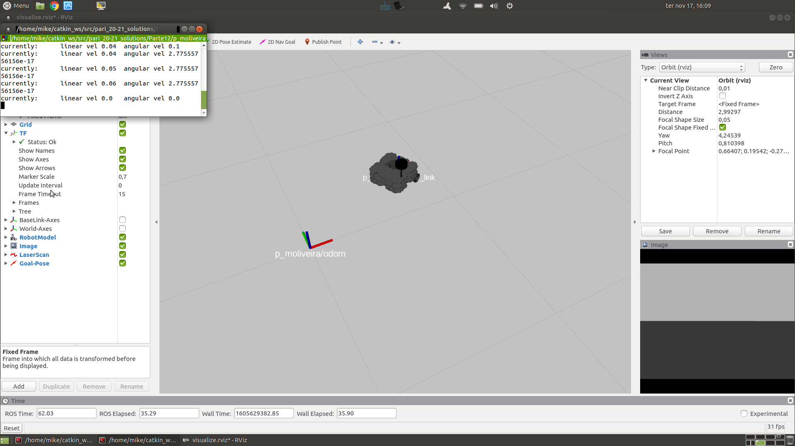
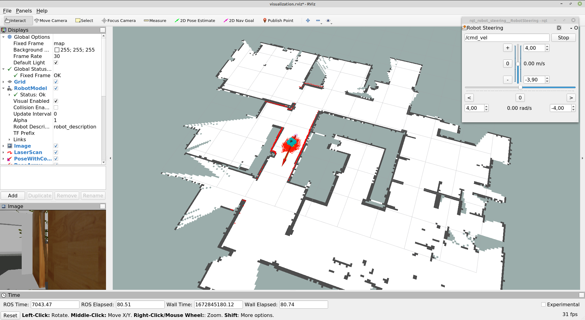

# Parte 13 - PSR

### Sumário

    Localização
    Odometria
    SLAM
    Navegação

A localização é o processo através do qual o robô é capaz de estimar a
sua posição no mundo. Existem várias formas de realizar localização,
desde algumas simples até outras bastante mais complexas.

Uma das formas mais utilizadas de localização é a odometria. Este
método consiste integração do movimento do robô ao longo do tempo por
forma a obter uma posição atual (em ROS tipicamente representadas pelo
sistema de coordenadas chamado */base_footprint* ou */base_link*), em
relação a uma posição inicial (em ROS representada por um sistema de
coordenadas designada por */odom*). Uma vez que a odometria apenas faz
a localização em relação a uma posição inicial, é chamado um sistema de
localização relativo (a essa posição inicial). Por oposição, um sistema
GPS é um sistema de localização absoluto.

Um paralelismo interessante é a forma como um pirata segue as instruções
num mapa do tesouro, por exemplo: Partindo da árvore grande (posição
inicial) e virado para sul (orientação inicial), dá 30 passos
(deslocamento relativo). Depois, vira para a esquerda (rotação
relativa). Caminha mais 15 passos. Estas instruções são na sua maioria
relativas, i.e., só são consistentes se se tiver em conta a posição em
relação à qual se referem.

A odometria funciona de modo similar. Sabendo o raio das rodas de um
robô, e sabendo a velocidade de rotação das mesmas é possível saber qual
foi o deslocamento por volta da roda (equivalente ao perímetro). A duas
dimensões é necessário utilizar modelos cinemáticos mais complexos que
são dependentes da configuração do robô. Neste caso estamos a utilizar
um robô diferencial, quer dizer, que tem duas rodas paralelas com
atuação independente.

Aqui um [tutorial
interessante](https://www.youtube.com/watch?v=aE7RQNhwnPQ) sobre modelos
diferenciais para robôs.

# Exercício 1 - Visualização da odometria do robô

Lance o seu robô (último exercício da Parte12) e visualize a árvore de
transformações.


Lance também o RViz e visualize estes sistemas de coordenadas.




Para conseguir visualizar o robô tem de selecionar na opção fixed frame
do RViz um sistema de coordenadas que esteja ligado ao robô.

# Exercício 2 - Localização e Mapeamento Simultâneo (SLAM)

Como falado atrás, a odometria é um sistema de localização
relativamente simples. Tem no entanto alguns problemas por ser um
sistema incremental. Erros nas estimativas de deslocamento vão-se
acumulando ao longo do tempo.

Os métodos Simultaneous Localization and Mapping (SLAM) fazem a
localização do robô usando para isso uma descrição da cena, o mapa, que
é atualizado em simultâneo. Assim, o robô, à medida que percorre o
cenário, vai-se localizando no mapa construído até ao momento, e essa
localização serve por outro lado para atualizar o próprio mapa.

Existem vários algoritmos de SLAM usando diferentes sensores. Os mais
simples empregam LiDARs 2D, como é o caso do
[gmapping](http://wiki.ros.org/gmapping).

Instale o gmapping com o comando:

    sudo apt-get install ros-noetic-gmapping

O gmapping funciona expandindo a árvore de transformações de modo a
inserir um sistema de coordenadas **map** que liga ao **odom**. Deste
modo é possível combinar as estimativas da odometria (transformações do
**odom** para o **base_footprint**) com as do SLAM (transformações do
**map** para o **odom**).


Neste exercício pretende-se utilizar o pacote **gmapping** para fazer
SLAM à medida que se teleopera o robô pelo cenário da casa do turtlebot.
Estude o software [gmapping](http://wiki.ros.org/gmapping) e tente
colocar a funcionar.

Para lançar o gmapping deverá remapear alguns nomes

    rosrun gmapping slam_gmapping scan:=/scan _base_frame:=base_footprint

Depois deverá conduzir o robô pelo cenário para construir o mapa.

No final deverá gravar o mapa usando o comando

```bash
rosrun map_server map_saver -f my_map
```

Crie um launch file **mapping.launch** que lance o nó de gmapping e o
rviz devidamente configurado.

O que se pretende é algo semelhante ao que está neste
[vídeo](https://youtu.be/tCvMIDy8Sf8).

Pode também ver este tutorial de construção de um mapa:
<http://wiki.ros.org/slam_gmapping/Tutorials/MappingFromLoggedData>

# Exercício 3 - Localização com AMCL

Configure o pacote [amcl](http://wiki.ros.org/amcl) para localizar o
robô usando o mapa gravado previamente.



Crie um launch file **localization.launch** que lance o nó de amcl e o
rviz devidamente configurado.

# Exercício 4 - Navigation

Utilize o [ros navigation
stack](http://wiki.ros.org/navigation/Tutorials) para navegar o robô
pelo apartamento.
